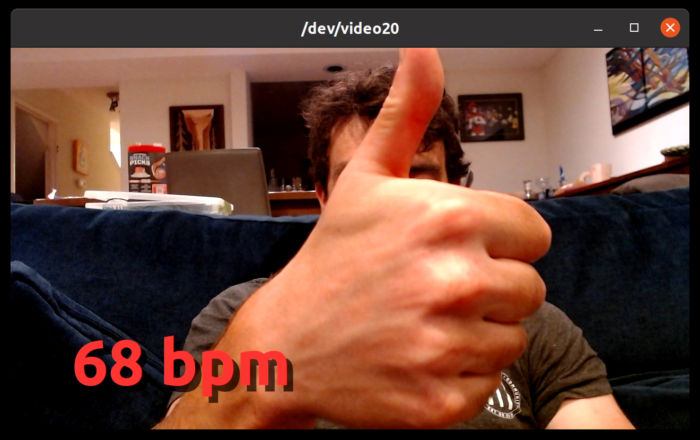

# BLE heart rate monitor webcam filter for Linux

## Motivation

I wanted an overlay with my heart rate for a Zoom fitness class I take,
because why not?  So I looked into using OBS with v4l2loopback.  It turns
out that writing a custom video input source for OBS is a huge pain and
can't be done in Python, and although I love Lua, it's not really
batteries-included enough to do what I want (I want to use GATT in some way
to pull from a HRM and Cairo to draw on an image, and that seems hard to
come up with a reproducible environment for in Lua).

It turns out that this is an enormous can of worms and literally no single
part of this is easy.  Cairo in Python is a huge pain in the butt and
requires a lot of format conversions (`RGB24`, well, isn't).  There appears
to actually be no good way to talk to a GATT device from Python on Linux. 
Or at all on Linux, for that matter.  I tried using `pygatt`, and it
inexplicably cannot reliably connect to a BLE device sometimes without first
being helped along by `gatttool`, so instead I use someone else's script
that does this huge ball of wax with `pyexpect` to talk to `gatttool`
directly (!!).  And `pyfakewebcam` requires RGB input -- which it then
immediately converts to YUV -- so I have to do *two* format conversions (one
from Cairo's bizarre BGRA format to RGB, one from RGB to YUV), which is
needlessly slow.

Anyway this took a lot longer than I had hoped and I got to reuse a lot less
than I hoped.  I was really hoping to just glue things together.  That
extremely did not happen.  Oh well.  Sometimes you get the elevator and
sometimes you get the shaft.

## Setup

To set this up:

* `sudo apt-get install python3-gst-1.0`
* `pip3 install -r requirements.txt`
* `sudo modprobe v4l2loopback devices=1 video_nr=20 card_label="v4l2loopback" exclusive_caps=1`
* `sudo hcitool lescan` to find the BLE address of your HRM
* Edit camcairo.py with your parameters (should I have an argument parser?  probably!)
* `python camcairo.py`
* To test: `ffplay /dev/video20`

## Credits

Based on https://github.com/fg1/BLEHeartRateLogger .  Implementation ideas
from https://elder.dev/posts/open-source-virtual-background/ , though I
ended up using Gstreamer because I initially blamed OpenCV for only getting
15fps out of my camera, but in the light of day discovered that I am a huge
idiot and the reason I was only getting 15fps was because there was not
enough light for the camera to do 30fps.
